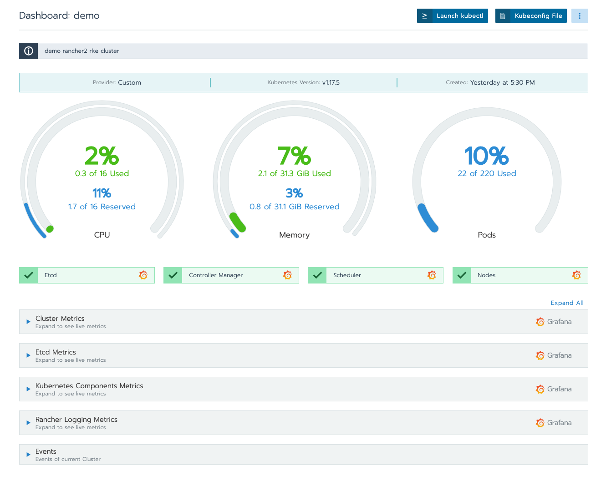
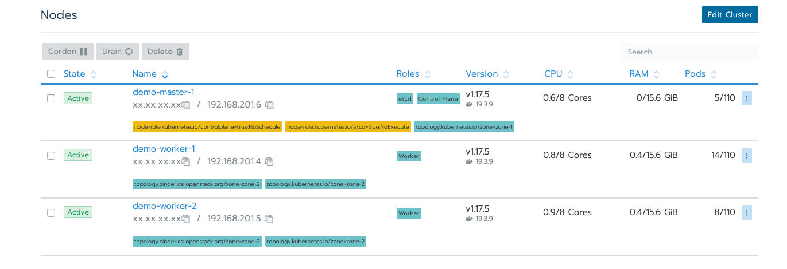

# terraform-rancher2
Terraform manifests to create e2e production-grade Kubernetes cluster on top of cloud providers

## Overview

This repo is intended to be for creating complete infrastructure pieces on OpenStack that are needed to have a fully provisioned Kubernetes cluster using Terraform and Rancher2. In addition to integration with [cloud-provider-openstack](https://github.com/kubernetes/cloud-provider-openstack)

## Getting started with Infrastructure
* Clone the repository [terraform-rancher2](https://github.com/rootsami/terraform-rancher2) into a folder.
* Go into the openstack folder using `cd openstack/`
* Modify the variables in `terraform.tfvars` to match your current cloud environment. it is important to uncomment the vars `openstack_project` , `openstack_username` and `openstack_password` or export them as env variables with prefix TF_VAR_*  for example: 
```bash
export TF_VAR_openstack_username=myusername
export TF_VAR_openstack_password=mypassword
export TF_VAR_openstack_project=myproject
```
* Other variables can be obtained from openstack-cli such as `rancher_node_image_id` , `external_network` by invoking
```bash
## image list
openstack image list
## network name
openstack network list --external
## flavors
openstack flavor list
```
* Run `terraform init` to initialize a working directory containing Terraform configuration files.
* To apply the creation of the environment, Run `terraform apply --auto-approve` and wait for the output after all resources finish the creation
```bash
Apply complete! Resources: 25 added, 0 changed, 0 destroyed.

Outputs:

rancher_url = [
  "https://xx.xx.xx.xx/",
]
```

Up to this point, use the `rancher_url` from above output and login to rancher instance with username `admin` and password defined in `rancher_admin_password`. Wait for all kubernetes nodes to be discovered, registered, and active.

## Integration with [cloud-provider-openstack](https://github.com/kubernetes/cloud-provider-openstack)
As you may notice, that all the nodes have a taint `node.cloudprovider.kubernetes.io/uninitialized`. The usage of `--cloud-provider=external` flag to the kubelet makes it waiting for the clouder-provider to start the initialization.
* Edit the file `manifests/cloud-config` with the access information to your openstack environment.
* Create a secret containing the cloud configuration in the kube-system namespace 
```bash
kubectl create secret -n kube-system generic cloud-config --from-file=manifests/cloud-config
```
* Create RBAC resources and openstack-cloud-controller-manager deamonset and wait for all the pods in kube-system namespace up and running.
```bash
kubectl apply -f manifests/cloud-controller-manager-roles.yaml
kubectl apply -f manifests/cloud-controller-manager-role-bindings.yaml
kubectl apply -f manifests/openstack-cloud-controller-manager-ds.yaml
```
* Create [cinder-csi-plugin](https://github.com/kubernetes/cloud-provider-openstack/blob/master/docs/using-cinder-csi-plugin.md) which are a set of cluster roles, cluster role bindings, statefulsets, and storageClass to communicate with openstack(cinder).
```bash
kubectl apply -f manifests/cinder-csi-plugin.yaml
```

Up to this point, openstack-cloud-controller-manager and cinder-csi-plugin have been deployed, and they're able to obtain valuable information such as External IP addresses and Zone info.

```bash
$ kubectl get nodes -o wide

NAME            STATUS   ROLES               AGE     VERSION   INTERNAL-IP     EXTERNAL-IP      OS-IMAGE             KERNEL-VERSION      CONTAINER-RUNTIME
demo-master-1   Ready    controlplane,etcd   5h      v1.17.5   192.168.201.6   xx.xx.xx.xx      Ubuntu 18.04.2 LTS   4.15.0-45-generic   docker://19.3.9
demo-worker-1   Ready    worker              4h57m   v1.17.5   192.168.201.4   xx.xx.xx.xx      Ubuntu 18.04.2 LTS   4.15.0-45-generic   docker://19.3.9
demo-worker-2   Ready    worker              4h56m   v1.17.5   192.168.201.5   xx.xx.xx.xx      Ubuntu 18.04.2 LTS   4.15.0-45-generic   docker://19.3.9
```




Also, as shown in the nodes tab, All nodes are active and labeled by openstack zones.



## Scalability
When it comes to scalability with IaaC (infrastructure-as-a-code), it becomes so easy to obtain any desired state in less consumed efforts and time.
All you have to do is to change the number of nodes `count_master` or `count_worker_nodes` and run `terraform apply` again
For example, let's increase the number of `count_worker_nodes` by 1
A few minutes later, after refreshing states and applying updates:
```bash

Apply complete! Resources: 3 added, 0 changed, 0 destroyed.

Outputs:

rancher_url = [
  "https://xx.xx.xx.xx",
]
```
Couple of minutes for the new node to be registered 
```bash
$ kubectl get nodes -o wide
NAME            STATUS   ROLES               AGE    VERSION   INTERNAL-IP     EXTERNAL-IP      OS-IMAGE             KERNEL-VERSION      CONTAINER-RUNTIME
demo-master-1   Ready    controlplane,etcd   28h    v1.17.5   192.168.201.6   xx.xx.xx.xx      Ubuntu 18.04.2 LTS   4.15.0-45-generic   docker://19.3.9
demo-worker-1   Ready    worker              28h    v1.17.5   192.168.201.4   xx.xx.xx.xx      Ubuntu 18.04.2 LTS   4.15.0-45-generic   docker://19.3.9
demo-worker-2   Ready    worker              28h    v1.17.5   192.168.201.5   xx.xx.xx.xx      Ubuntu 18.04.2 LTS   4.15.0-45-generic   docker://19.3.9
demo-worker-3   Ready    worker              2m2s   v1.17.5   192.168.201.7   xx.xx.xx.xx      Ubuntu 18.04.2 LTS   4.15.0-45-generic   docker://19.3.9
```

**NOTE: Scaling down the cluster could be made by decreasing the number of nodes in `terrafrom.tfvars`. Node gets deleted, moreover `cloud-provider-openstack` detects that and removes it from the cluster** 

## Cleanup
To clean up all resources created by this terraform, Just run `terraform destroy`

## References
* [Rancher2 Provider](https://www.terraform.io/docs/providers/rancher2/)
* [Openstack Provider](https://www.terraform.io/docs/providers/openstack/)
* [Cloud-provider-openstack](https://github.com/kubernetes/cloud-provider-openstack)
* [Running-cloud-controller-manager](https://kubernetes.io/docs/tasks/administer-cluster/running-cloud-controller/#running-cloud-controller-manager)
